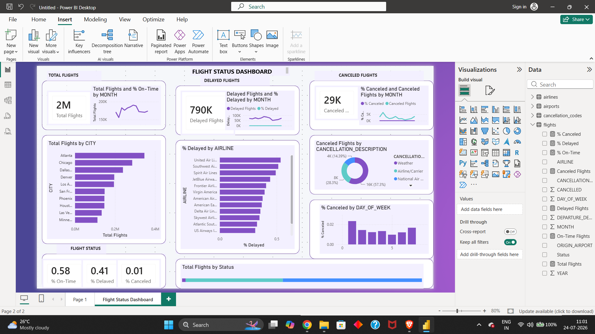

# ✈️ Flight Operations Dashboard

## 📌 Project Overview

This project presents an interactive Flight Operations Dashboard built using Microsoft Power BI. It provides insights into airline performance, delays, cancellations, passenger trends, and operational efficiency.

---

## 🛠 Tools Used

- Microsoft Power BI
- Microsoft Excel
- Power Query
- DAX

---

## 📊 Dashboard Features

- Total Flights
- Delayed Flights
- On-Time Performance
- Flight Status Analysis
- Airline Performance
- Monthly Trends
- Interactive Filters

---

## 📷 Dashboard Preview

---

## 📈 Key Insights

- Identified peak flight periods.
- Compared airline performance.
- Tracked delay trends.
- Monitored operational efficiency.

--- 

## 📁 Repository Contents

- 📊 Power BI Dashboard (.pbix)
- 🖼️ Dashboard Preview Image (.png)
- 📄 README.md

---

## 👤 Author

Anubhav Chhatriya
